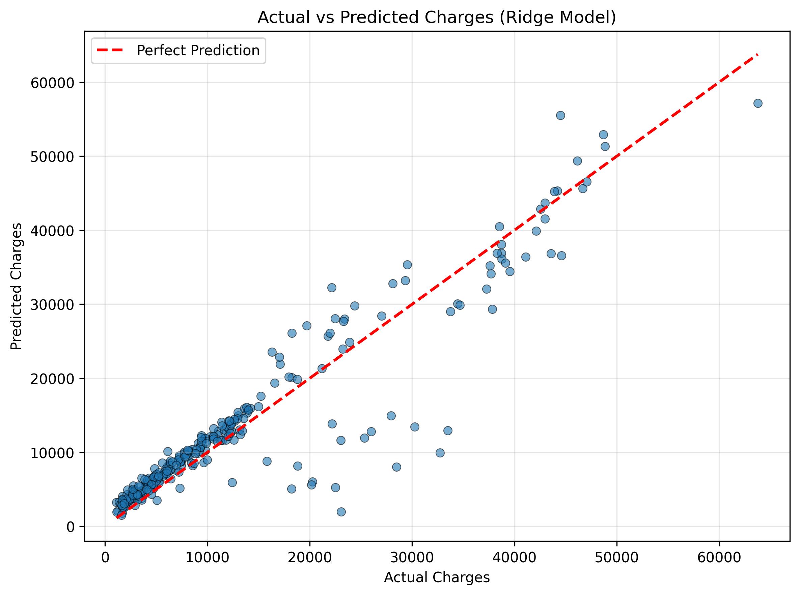
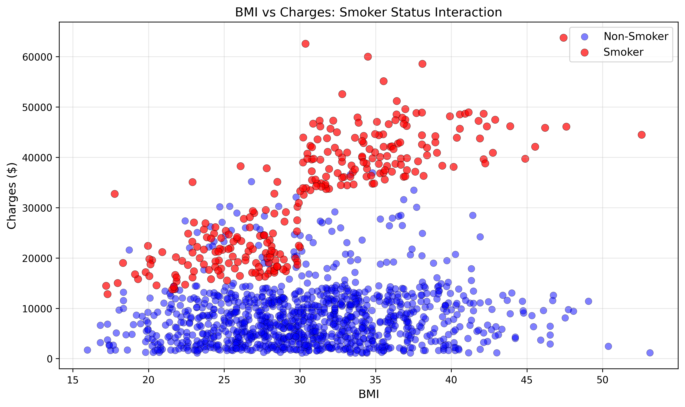
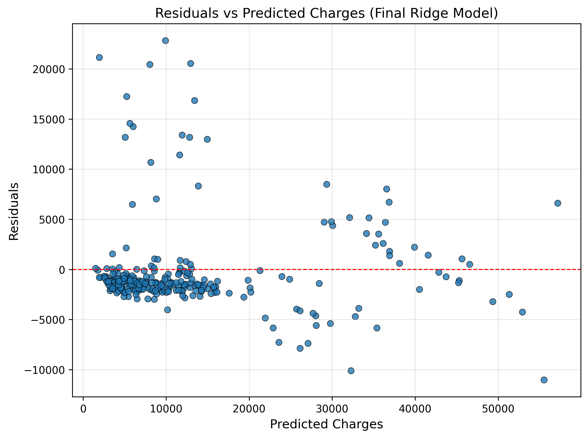

# 🏥 Medical Insurance Premium Predictor

[](https://www.python.org/)
[](https://scikit-learn.org/)

## 🎯 The Objective
The objective of this project is to build a robust machine learning regression model capable of accurately predicting the medical insurance costs billed by health insurance companies. By analyzing patient demographics and lifestyle factors, this tool helps identify the primary drivers of insurance premiums, enabling fairer and more transparent pricing estimations.

## 📊 The Data
This project utilizes a medical insurance dataset containing individual patient records and their corresponding medical costs. The dataset consists of:
* **Numerical Features:** `age`, `bmi` (Body Mass Index), `children` (number of dependents), and `charges` (the target variable).
* **Categorical Features:** `sex`, `smoker` (yes/no), and `region` (residential area).

## 🧠 The Approach
To capture the complex, non-linear relationships within the health data without overfitting, the following pipeline was implemented:

1. **One-Hot Encoding:** Applied to categorical variables (`sex`, `smoker`, `region`) to convert them into a machine-readable numeric format without improperly imposing ordinality.
2. **Polynomial Features:** Engineered degree-2 polynomial features. This was a critical step to capture interactions between independent variables (e.g., how the combination of smoking and high BMI affects costs differently than either factor alone).
3. **L2 Regularization (Ridge Regression):** Because polynomial expansion vastly increases the number of features, Ridge Regression (L2 penalty) was applied. This shrank the less important coefficients, mitigating the curse of dimensionality and preventing the model from overfitting to the training data.

## 🏆 The Results
The final Ridge Regression model with Polynomial features demonstrated strong predictive capabilities on unseen test data:

* **Final Test $R^2$:** `0.86`
* **Final Test RMSE:** `$ 4550.32`

### Key Insights
* **The BMI / Smoker Interaction:** The model successfully captured a massive interaction effect between smoking and BMI. While a high BMI alone causes a moderate, steady increase in premiums, a high BMI *combined* with smoking triggers an exponential spike in costs. Standard linear models miss this, but our polynomial features successfully modeled this severe health risk penalty.
* **Heteroscedasticity:** Residual analysis revealed signs of heteroscedasticity (the variance of errors increases at higher predicted charges). This makes logical sense in healthcare: base costs for healthy individuals are highly predictable, but the costs for severe medical events (which apply to the high-risk pool) carry massive variance. 

## 📈 Visualizations


### 1. Actual vs. Predicted Charges

> *A scatter plot showing the strong linear alignment between our model's predictions and actual medical charges. The closer the points are to the diagonal line, the better the prediction.*

### 2. BMI & Smoker Interaction

> *Visualizing how the slope of charges vs. BMI drastically changes depending on the patient's smoking status.*

### 3. Residual Plot (Heteroscedasticity Check)

> *Plotting residuals against predicted values. The "cone" or "fan" shape appearing at the higher end of the charge spectrum illustrates the heteroscedasticity discussed in the insights.*

---

## ⚙️ Setup & Installation

To run this project locally:

```bash
# Clone the repository
git clone [https://github.com/moustafa-ash/Medical-Insurance-Premium-Predictor.git](https://github.com/moustafa-ash/Medical-Insurance-Premium-Predictor.git)

# Navigate to the directory
cd Medical-Insurance-Premium-Predictor

# Install required dependencies
pip install -r requirements.txt